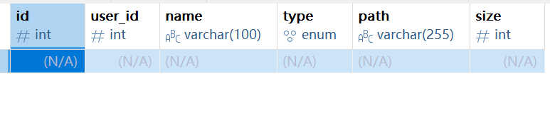
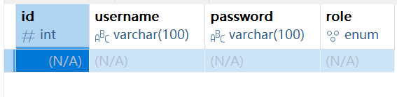
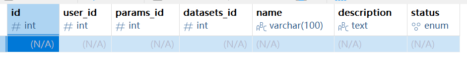
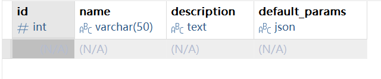
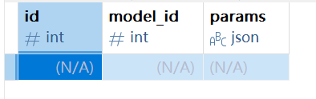
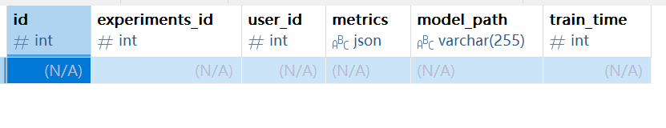
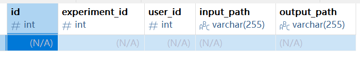

## 环境配置
使用vscode，配置未出现问题

## 项目选题
选择制作一个模型托管平台，由用户自己上传数据集，可选择系统预制的模型算法进行训练，也可以自己制作模型，并可以将模型保存以随时进行预测

## 数据库
### E-R图

### 可视化数据库 (naviCat)

#### 数据集：

#### 用户：

#### 实验：

#### 模型：

#### 参数：

#### 训练结果：

#### 预测结果：

