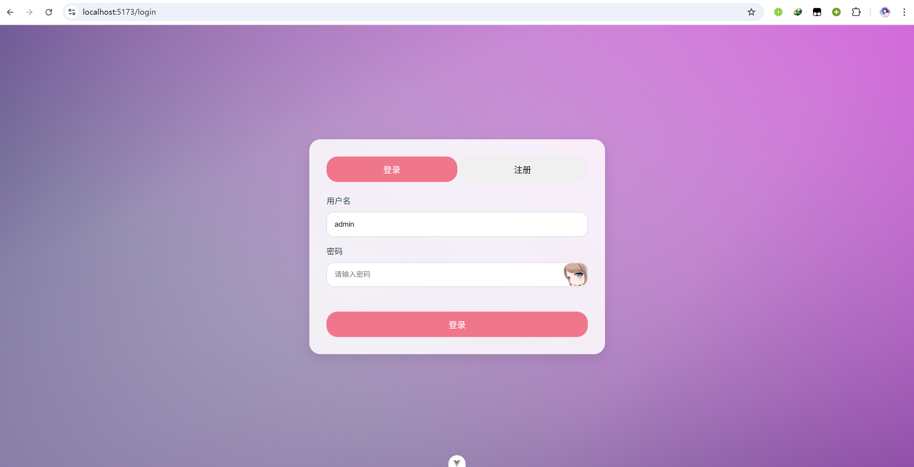
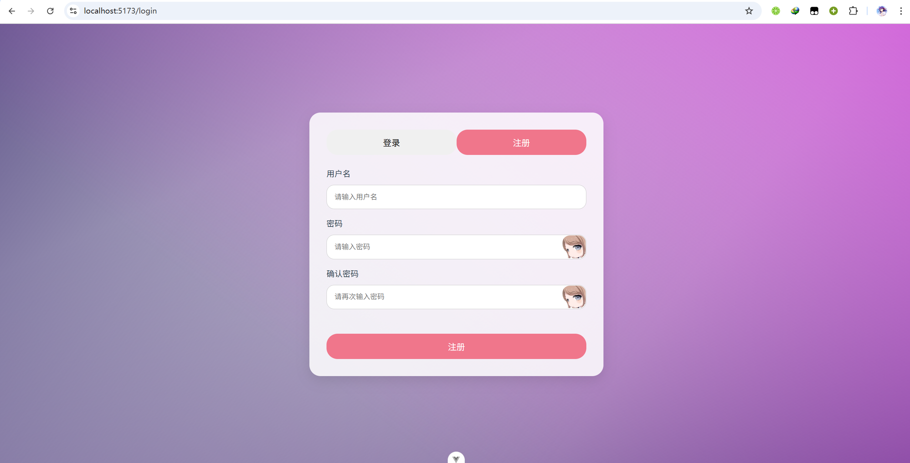

# 简介

**[前端](../vue/) 使用vue框架，[后端](../flask/) 使用python flask + pymysql处理**  

**目前已完成**
1. 前端整体的结构，导航栏
2. 后端使用 flask + BluePrint 处理各个路由
3. 用户登录注册
4. 完善的Home页
5. 可以上传、模糊查询、删除的数据集管理

  ---
# 具体
### 一、前端整体结构
采用了 elements 组件库中的 el-container 来划分结构为 header 和 main 

header 为导航栏，main 则为路由出口

在登录页面条件渲染，将整体结构隐藏，不渲染 NavBar

代码:
```vue
<template>
  <div id="app">
    <el-container class="app-container w-full">
      <el-header v-if="!$route.meta.hide" class="header">
        <NavBar />
      </el-header>
      <el-main v-if="!$route.meta.hide"><router-view /></el-main>
      <router-view v-else></router-view>
    </el-container>
  </div>
</template>
```
---
### 二、登录页面
登录和注册仅差一个 “确认密码”， 所以在同一个地方条件渲染即可。

同样的，显示/隐藏密码也仅需条件渲染，使密码输入框从 text / password 来回转换。

本页面的大致工作流程为：

- 注册：
  - 读取用户名和密码
  - 以JSON形式发送至后端
  - 后端接受并检验是否符合要求
  - 将密码以SHA256加密并储存到数据库
  - 向前端返回成功信息
  - 前端获得成功信息，反馈用户后跳转到登录界面
- 登录：
  - 读取用户名和密码
  - 发送至后端
  - 后端接受并经过SHA256处理
  - 从数据库查询该用户名的密码是否匹配
  - 若成功则将当前用户存到数据库中，来表示"当前用户"，这样即使页面刷新也不会要求重新登录
  - 向前端返回对应信息

前端代码位置：[跳转](../vue/src/views/Login.vue)  

后端代码位置：[跳转](../flask/user/login.py)

前端界面截图：
<div style="display:flex; flex-direction: column;">


</div>


---

### 三、NavBar 导航栏

父元素为 el-header，全局在头部渲染，渲染完成后调用getFetch函数来从后端获取数据(当前用户等)，若获取到当前用户的id为0(预留的)则表示当前使未登录状态，接下来会强制跳转到登录界面

最左端为我的各个平台的个人主页，用作装饰，最右端则为各个页面的路由跳转按键

前端代码位置：[跳转](../vue/src/components/NavBar.vue)

效果截图见下面的 Home 页

---

### 四、Home 主页

最上方渲染一个 welcome 栏，写着欢迎标语，将当前时间写为一个组件并在中心位置渲染 (组件位置：[跳转](../vue/src/components/myClock.vue))；

最右端写着行楷体的诗句 (后端共准备了90句诗，每次随机一首，并且保证本句诗在30次内不会再次出现)

接下来是个人统计页，统计了在本平台的各个数据

右侧是一个视频播放器，可以自由选择B站视频，后期考虑新增随机选择机器学习相关视频并播放

前端代码位置：[跳转](../vue/src/views/Home.vue)

后端数据处理代码位置：[跳转](../flask/user/get_data.py)

界面截图:


---

### 五、数据集管理页

功能已经基本完善，目前还在优化，不再赘述